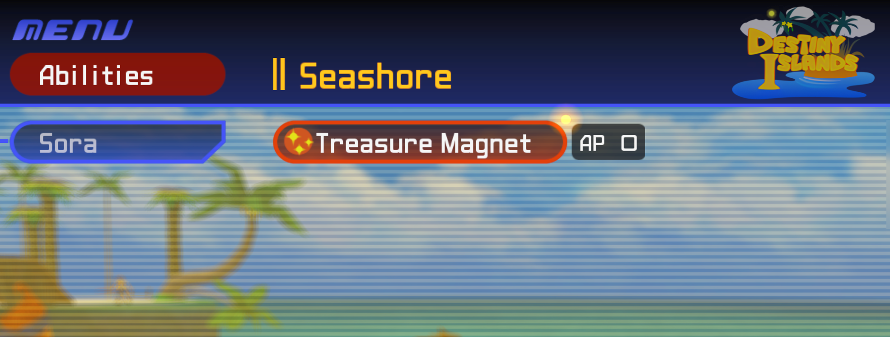

# Treasure Magnet Starter

[Download Treasure Magnet Starter on Nexus Mods](https://www.nexusmods.com/kingdomheartsfinalmix/mods/258)

**Version 1.0.0 — ROXASBrandon**

Get Treasure Magnet at the start of your adventure and equip it for **0 AP**.
Works with new games and existing saves; no level requirement and no restart
of your playthrough needed.

## Features

- Grants Sora one ordinary Treasure Magnet if he does not already own it.
- Starts unequipped: open **Abilities > Sora** to enable it.
- Sets Treasure Magnet's AP cost to zero for all copies and party members.
- Leaves pickup range, AP capacity, other abilities, and level rewards alone.
- Avoids duplicate grants if the ability is already present.

The early grant is a **bonus copy**. Vanilla level rewards still apply, so you
may eventually obtain an extra stackable copy. Wait about one second during
normal gameplay for the grant; cutscenes, loading, gummi travel, and dead Sora
are excluded. Save normally to retain the unlocked ability.

## Requirements

- Kingdom Hearts Final Mix from **Steam**, **Global/WW version 1.0.0.2**.
- LuaBackend installed and working. OpenKH Mods Manager is recommended.
- This release has not been ported to Epic Games, Steam JP, PS2, or other builds.
  The script checks the executable and refuses unsupported versions.
- No extra Lua library or companion script is required.

## Installation

Choose **one** method:

1. **OpenKH / GitHub:** select Kingdom Hearts 1 in Mods Manager, open **Mods >
   Install new mods**, and enter `ROXASBrandon/KH1FM-Treasure-Magnet-Starter` in the GitHub field.
   Click **Install**, enable the mod, then **Mod Loader > Build and Run**.
   You can also import the release ZIP or standalone Lua through the archive
   option instead. For updates, use **Settings > Check Mods for Updates** and
   rebuild your KH1 mod list.
2. **Manual LuaBackend:** copy the script from this archive's `scripts` folder to
   `Documents\My Games\KINGDOM HEARTS HD 1.5+2.5 ReMIX\scripts\kh1`.
   Your LuaBackend configuration must load that folder. Restart KH1.

Press **F2** for LuaBackend confirmation messages. Install a given script only
once; do not use the OpenKH and manual methods simultaneously.

If upgrading from the earlier combined script, remove/disable
`kh1_early_treasure_magnet.lua` first. These two standalone mods can be used
individually or together. Do not also enable another mod editing the same
Treasure Magnet behavior; changed signatures can make the patch skip.

## Removal and save behavior

Back up your save before installing. Close KH1 and remove/disable the script;
Treasure Magnet returns to its normal 2 AP cost on the next launch. The early
ability remains in any saves made after it was granted. To undo that grant,
restore your own pre-mod save backup, which also rolls back later progress.

The script does not edit save files on disk directly or alter game archives.
If the displayed AP total has not refreshed after a cost change, toggle Treasure
Magnet off and back on in the Abilities menu.

## Verification

The original combined implementation was confirmed working in gameplay on
Steam Global 1.0.0.2. This standalone extraction passed byte-accurate Lua 5.4
checks for early grants, AP metadata preservation, duplicate avoidance, load
states, and compatibility with Treasure Magnet Vacuum. The separate package
has not yet received a fresh gameplay verification after extraction.

See `CREDITS.md` for reference credits and `CHANGELOG.md` for release notes.

## My other mods

- [Keyblade Transmog](https://github.com/ROXASBrandon/KH1FM-Keyblade-Transmog) — press Q to cycle Keyblade looks and hit sounds while keeping your equipped Keyblade's stats.
- [Treasure Magnet Vacuum](https://github.com/ROXASBrandon/KH1FM-Treasure-Magnet-Vacuum) — 500x pickup range for items and HP/MP/munny orbs.
